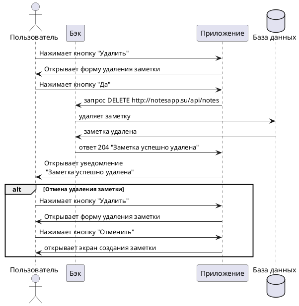

# Пользовательский сценарий «Удаление заметки»

--8<-- "source:notification"

## Действующие лица:

1. Пользователь

2. Приложение

3. Бэк

4. База данных

## Предварительные условия

1. В системе существует минимум одна заметка.

2. Пользователь должен находиться на экране просмотра заметки.

## Выходные условия

Заметка удалена из системы и не отображается в списке заметок пользователя.

## Основной сценарий

1. Пользователь нажимает кнопку **Удалить**.
2. Приложение открывает пользователю окно подтверждения удаления заметки.
3. Пользователь подтверждает удаление и нажимает кнопку **Да!**
4. Приложение отправляет запрос `DELETE http://notesapp.su/api/notes` Бэку на удаление заметки.
3. Бэк удаляет заметку из Базы данных.
4. Бэк возвращает Приложению ответ 204 "Заметка успешно удалена" об успешном удалении заметки.
5. Приложение открывает пользователю уведомление «Заметка успешно удалена».

## Альтернативный сценарий

1. Пользователь нажимает кнопку **Удалить**.
2. Приложение открывает пользователю окно подтверждения удаления заметки.
3. Пользователь нажимает кнопку **Отменить**.
4. Приложение открывает пользователю экран просмотра заметки.

## Диаграмма последовательности

